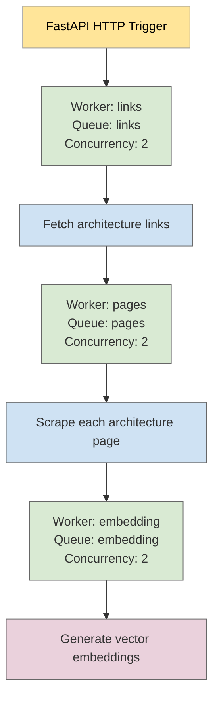

# Explanation of the Implemented Approach & Architecture

## Implemented Approach

This project implements an end-to-end pipeline to scrape, store, and embed architectural documentation from the Azure Architecture Center using the following approach:

1. **Scraping Links**:
A Celery task (`fetch_links_task`) scrapes all available architecture page URLs from the Azure index and stores them in MongoDB.

2. **Scraping Page Data**:
A second task (`scrape_each_page_task`) fetches and parses each architecture page’s content (title, tags, and main content), and stores the parsed results as structured documents in MongoDB.

3. **Generating Embeddings**:
The third task (`embed_all_pages_direct`) reads unsynchronized documents, chunks their content, sends them in batches to Ollama’s `/api/embed` endpoint, and saves the resulting embeddings in a FAISS vector index. Metadata is stored alongside for later retrieval and semantic search.

Each task is isolated and queued separately, allowing for asynchronous parallel execution or chained sequential workflows, depending on the use case.

* Note: Although each Celery worker is configured with `concurrency=2` to allow multiprocessing, the overall task execution is **not asynchronous** — the `scrape-all` endpoint uses a `chain`, ensuring each task starts only after the previous one has completed.

## Celery-Based Multiprocessing Architecture

This architecture utilizes a FastAPI HTTP endpoint to trigger a chain of three Celery tasks.
Each task is handled by a separate worker, connected to a specific queue, and executed with a concurrency level of 2.

Although each worker is configured to run multiple processes concurrently, the tasks are currently executed sequentially using a Celery `chain`, meaning each task begins only after the previous one completes.

## Future Enhancements

Replace the current sequential Celery.chain with an asynchronous task flow that enables parallel execution of independent stages (e.g., scraping and embedding), improving total throughput.