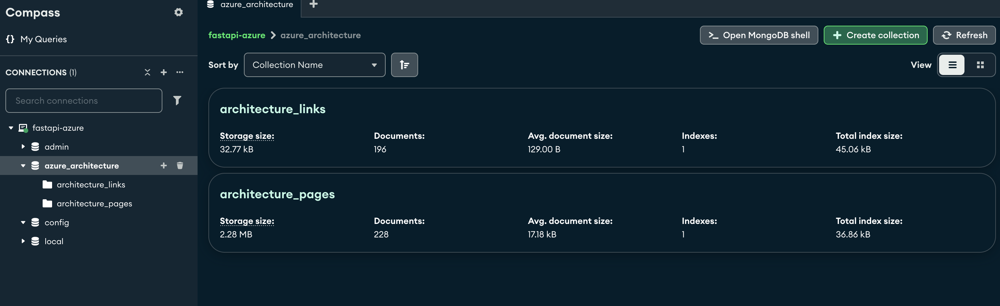
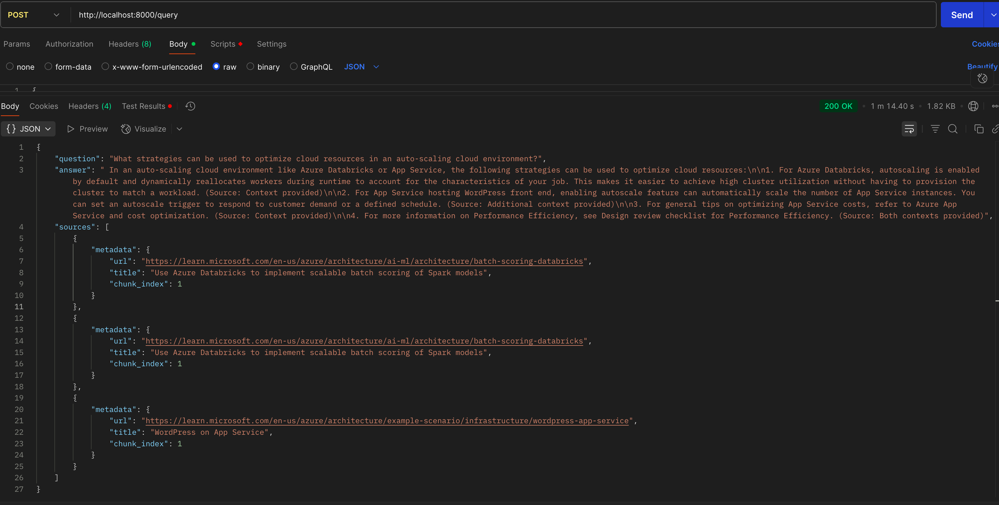

# ☁️ Cloud Architecture Search

This project aims to optimize cloud architecture solutions, helping organizations maximize the efficiency and scalability of their cloud infrastructures. The system uses FastAPI for the backend, FAISS for fast similarity search, Selenium for web scraping, and Ollama for AI-powered question answering.

## 🧭 Overview

Organizations spend millions on cloud infrastructure but often struggle to identify the best architecture solutions for their use case. This project solves this problem by leveraging multiple technologies to provide the best possible cloud architecture based on various requirements such as performance, scalability, and cost efficiency.

## 🧰 Technologies Used

- **FastAPI**  
- **Celery**  
- **Redis**  
- **MongoDB**  
- **FAISS**  
- **Selenium**  
- **Ollama**


## Getting Started

These instructions will help you set up the project locally using Docker Compose.

---

### Setup Instructions

1. **Clone the repository**:
   ```bash
   git clone https://github.com/Evyatarashuri/azure-architecture.git
   cd azure-architecture
׳׳׳

🚨 Make sure Docker Desktop is running in the background before executing the following command.

2. **Running with Docker-compose: Build & Run**:
```bash
docker-compose up --build
```

⚠️ System Requirements
In order to run the endpoints, Make sure your machine has at least:

* 12 CPU cores
* 8 GB RAM available

Running on lower specs may lead to failures or long processing times.

3. **API Endpoints (Use with Postman)**:

1. This endpoint triggers all scraping tasks and runs embeddings:
```bash
GET http://localhost:8000/scrape-all
```
What it does:

* Scrapes all architecture links from the Microsoft Azure Architecture Center.

* Scrapes each architecture's content.

* Embeds the content into FAISS for semantic search.

2. This endpoint allows you to ask a question and get an answer based on the indexed architectures:
```bash
POST http://localhost:8000/query
```
Body example (JSON):
```bash
{
  "question": "What is the best architecture for high-performance applications in Azure?"
}
```
Check out [`example-questions.md`](example-questions.md) 

---

## 📄 Technical Decisions - in building

For a deeper look into architectural decisions, trade-offs, and ideas for scaling or productionizing the app, check out the  
👉 [DECISIONS.md](./DECISIONS.md)

---

## 📸 UI & Tooling Previews

### 🐳 Docker Desktop – Resource Usage


### 🍃 MongoDB Compass – Stored JSON data


### 📬 Postman – Model Response Example


---
